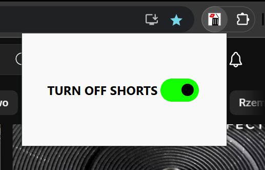

# Shorts Blocker

Shorts Blocker is a Chrome extension created for personal use, designed to block short video content on various websites. This extension helps users avoid distractions and stay focused by filtering out short videos.

## Features

- Blocks short video content on supported websites
- Easy to enable and disable
- When I have time, I will add customisation and maybe a way to block shorts from various websites. 

## Instalation 
 - Go to Select More Tools and choose Extensions
 - Turn on Developer Mode
 - Use Load unpacked button and select folder with extension files
 - Pin extension in browser extension panel
   
## Usage

1. Click on the Shorts Blocker icon in the Chrome toolbar.
2. Toggle the blocker on or off.

